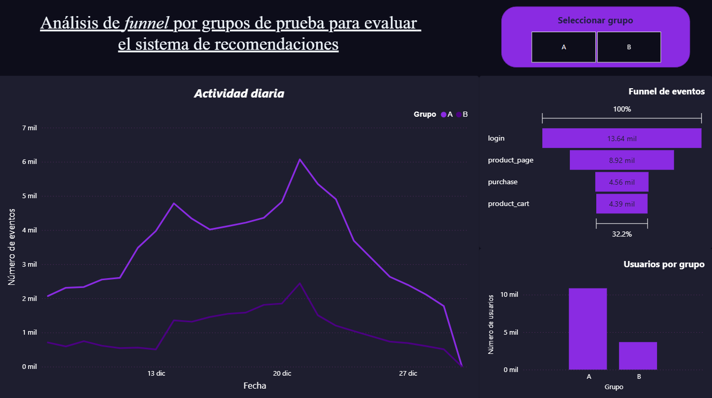

# 📊 Evaluación de un Sistema de Recomendaciones mediante Prueba A/B
En este proyecto analicé los resultados de una prueba A/B diseñada para evaluar el impacto de un sistema de recomendaciones mejorado sobre el comportamiento de los usuarios en un entorno de comercio electrónico. Adicionalmente, a través de un dashboard interactivo desarrollado en Power BI, el análisis se centra en métricas clave del funnel de conversión, con el objetivo de evaluar si la nueva versión del sistema genera mejoras significativas en el desempeño del negocio durante los primeros 14 días posteriores a la inscripción del usuario.

## 🎯 Objetivos

* Evaluar si el sistema de recomendaciones mejorado incrementa la conversión en etapas clave del funnel.
* Medir el impacto del cambio en:
  * Vistas a la página de producto
  * Artículos agregados al carrito
  * Compras completadas
* Validar estadísticamente los resultados mediante pruebas de hipótesis.
* Generar conclusiones accionables para la toma de decisiones estratégicas.

## 📈 Análisis de funnel por grupos de prueba

## 📈 Hallazgos Clave

* Durante la preparación de los datos fue necesario eliminar registros de usuarios sin grupo asignado, así como usuarios duplicados presentes en ambos grupos.
* El grupo A contó con aproximadamente tres veces más usuarios que el grupo B, situación que no invalida la prueba, pero que debe considerarse en la interpretación de los resultados.
* El análisis exploratorio mostró comportamientos similares entre los grupos en la mayoría del periodo evaluado.
* Se identificaron diferencias cercanas al 10–11% en:
  * La conversión de usuarios que acceden a la página de producto.
  * La tasa diaria de usuarios que completan la compra.
* En ambos casos, el grupo A presentó mejores resultados que el grupo B.

## 🔍 Conclusiones Estratégicas
Los resultados del test Z confirman que el sistema de recomendaciones mejorado no supera al sistema actual en términos de conversión global. Aunque se observaron diferencias significativas en etapas específicas del funnel, estas favorecieron al grupo A (control), lo que indica que el nuevo sistema no aporta un beneficio incremental claro.

El análisis sugiere que optimizaciones futuras deben enfocarse en mejorar la etapa inicial del funnel, particularmente el acceso a la página de producto.

Para futuras pruebas A/B se recomienda:
* Mantener un balance más equitativo entre los grupos.
* Monitorear la conversión acumulada a lo largo del tiempo.
* Garantizar un etiquetado correcto y consistente de los usuarios.

## 🧪 Herramientas y Tecnología
* Python
* Pandas
* NumPy
* Matplotlib
* Seaborn
* Plotly
* Statsmodels (prueba Z de proporciones, corrección por comparaciones múltiples)
* Jupyter Notebook

